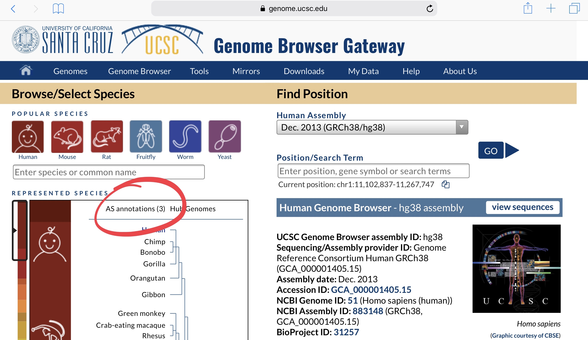
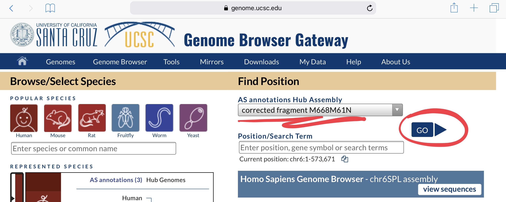
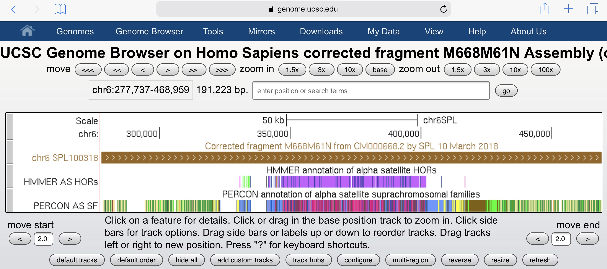
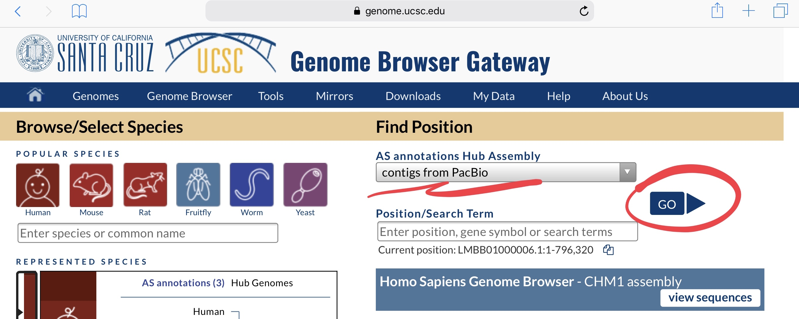
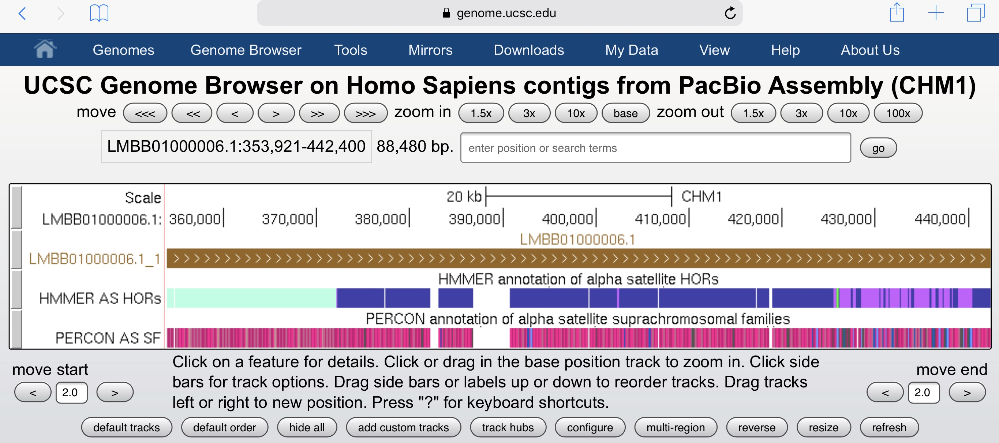
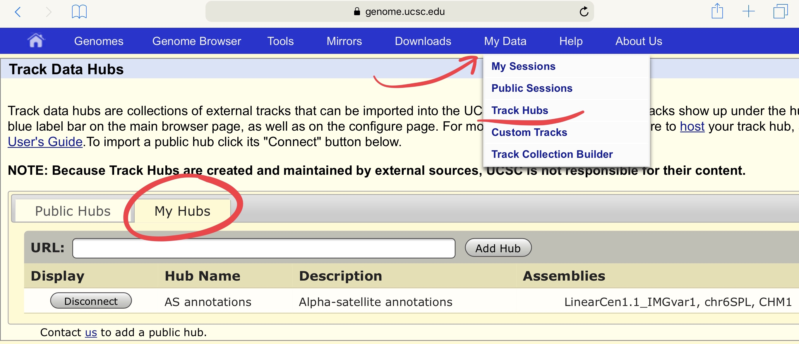

# Experimental assemblies and annotations

Link to the test version of the [AS annotation hub](https://genome.ucsc.edu/cgi-bin/hgHubConnect?hgHub_do_redirect=off&hgHubConnect.remakeTrackHub=on&hubUrl=https://raw.github.com/enigene/test-hubAssembly/master/hub.txt)

After you open the link click on the *AS annotations*

Choose corrected fragment

Example of an annotation for M668M61N

Choose contigs from PacBio

Example of an annotation for LMBB01000006.1

On this page You can control track hubs

